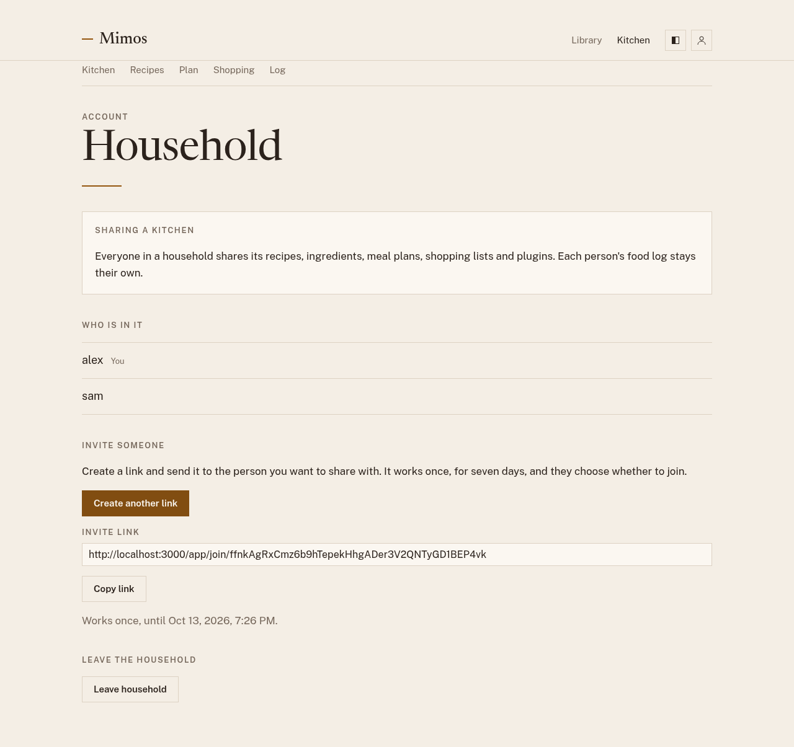

# Household

A household is the people who cook together. Everyone in it shares one
recipe book, one set of meal plans, and one shopping list, while each
person keeps their own food log. When you sign up you are a household of
one.

To see yours, open the profile menu at the top right and choose
**Household**.

## What is shared

| Shared with your household       | Yours alone   |
| -------------------------------- | ------------- |
| Recipes, and who added each one  | Your food log |
| Ingredients you added            |               |
| Meal plans                       |               |
| Shopping lists                   |               |
| Plugins and what they remember   |               |

Everyone in a household is equal. Anyone can add, change, or delete its
recipes, plan its meals, and tick off its shopping list. A recipe someone
else added says **Added by** them, in the recipe list and above the recipe.

## Sharing meals

Each planned meal says who in the household eats it. A new dinner is for
everyone; a new breakfast, lunch, or snack is for the person who planned
it. Anyone can change who eats a meal. The plan shows your meals or
everyone's, and when you log a meal you shared, you log your share of it.
See [Planning for a household](planning.md#planning-for-a-household) and
[Logging a planned meal](log.md#logging-a-planned-meal).

## Invite someone

1. On the Household page, under **Invite someone**, choose **Create invite
   link**.
2. Choose **Copy link** and send the link to the person you want to share
   with, in a message or an email.

The link works once, for seven days; the page says until when. Anyone in
the household can create one. If it expires or someone else uses it,
create another.

## Join a household

Open the invite link you were sent. If you are not signed in, sign in, or
register if you are new; Mimos brings you back to the invite.

The page names whose household it is and says what joining changes for
you. Choose **Join household** to join, or **Not now** to leave things as
they are.

What joining does depends on whether you share a household already:

- **On your own:** your recipes and the ingredients you added come with you
  into the household. Your meal plans, shopping lists, and plugin settings
  are deleted, and you use the household's instead.
- **Already sharing a household:** you leave it first. Its recipes,
  ingredients, meal plans, and shopping lists stay with it, including the
  ones you added.

Either way, your food log stays yours. Nobody else in the household sees
it.

## Leave a household

On the Household page, choose **Leave household**. Mimos says what stays
and what goes, and asks you to confirm.

When you leave:

- The household keeps its recipes, ingredients, meal plans, and shopping
  lists, including the ones you added. To keep a copy of the recipes,
  [export your data](your-data.md) first.
- You stop eating the meals planned there. A meal only you were eating is
  removed from the plan.
- You keep your food log. Meals you logged from the household's recipes
  keep their calories and macros but no longer link to the recipe.
- You start again as a household of one.

Nobody can remove someone else from a household. If you are the only one
in your household, there is nothing to leave.
