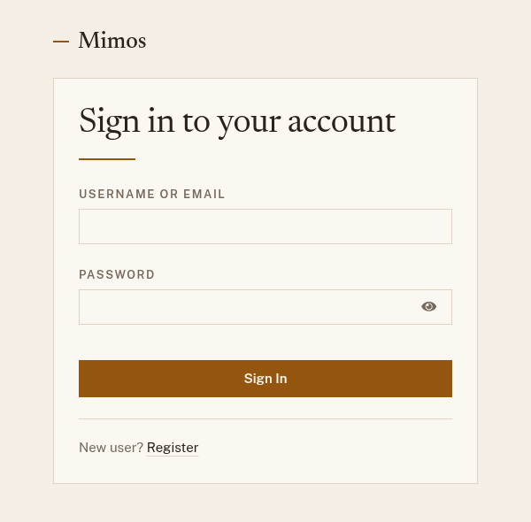
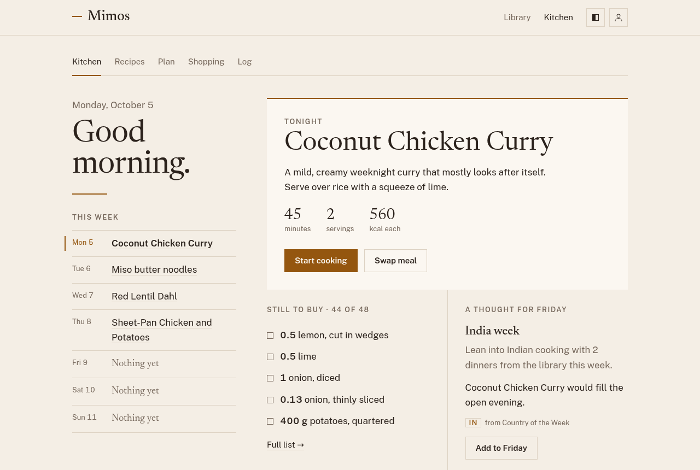
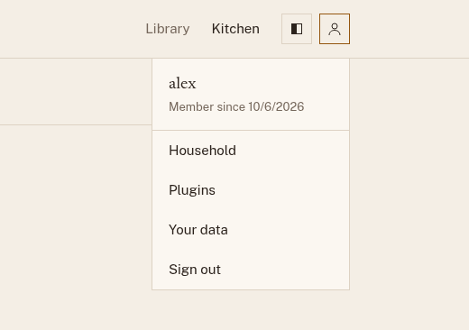

# Getting started

Mimos runs in your web browser, on a computer or a phone. There is nothing
to install. You need the address of a Mimos server: one someone runs for
you, or [your own](../self-hosting.md).

## Browse without an account

The recipe library is public. Choose **Library** at the top of any page to
browse and search it, and open a recipe to cook from it. You only need an
account to keep your own recipes, plan meals, and log what you eat.

## Create an account and sign in

Choose **Kitchen** at the top of the page, then **Sign in**. If you are new,
choose **Register** under the sign-in form and fill in your details.

{ width="420" }

!!! note "No Register link?"
    Whoever runs your Mimos can turn registration off. If they have, ask
    them to create an account for you.

Mimos keeps you signed in while you use it. After a long break, such as a
tab left open overnight, it asks you to sign in again.

## Find your way around

After you sign in you land in the **Kitchen**, your home page. It shows
tonight's dinner with a button to start cooking it, the week's dinners down
the side, what's still on your shopping list, and sometimes a suggestion for
an open evening.

The row of links under the header takes you to each part of Mimos:

| Link         | What it's for                                                    |
| ------------ | ---------------------------------------------------------------- |
| **Kitchen**  | Your home page: tonight, this week, and what's left to buy.      |
| **Recipes**  | Your own recipes and the library. See [Recipes](recipes.md).     |
| **Plan**     | The week's meals. See [Planning a week](planning.md).            |
| **Shopping** | The week's shopping list. See [Shopping list](shopping-list.md). |
| **Log**      | What you ate, with calories and macros. See [Food log](log.md).  |

The square with a person icon, at the top right, opens your profile menu:

{ width="420" }

- **Household** shows who you share recipes, plans, and shopping with, and
  invites someone new. See [Household](household.md).
- **Plugins** turns add-ons on and off. See [Plugins](plugins.md).
- **Your data** downloads everything you've added, or restores it. See
  [Your data](your-data.md).
- **Sign out** signs you out on this device.

The button next to it switches between the light and dark themes. Mimos
starts in light and remembers your choice in each browser.

## Your first week

1. Open **Recipes**, look through the **Library** tab, and pick a few
   dinners you like the look of.
2. Open **Plan** and add them to the days you'll cook them.
3. Open **Shopping** and choose **Generate from this week's plan**. Take
   the list to the store.
4. On the night, open the **Kitchen** and choose **Start cooking**.

You can also ask an AI agent to do any of this for you. See
[Use Mimos from an AI agent](agents.md).
