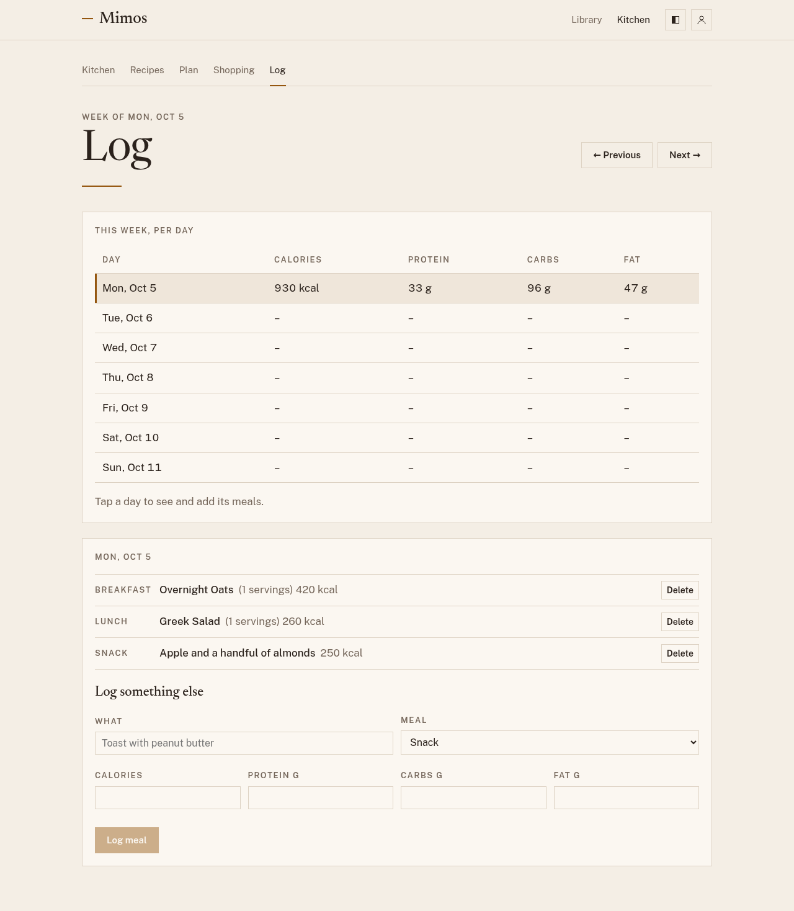

# Food log

Open **Log** to see what you've eaten, with calories, protein, carbs, and
fat added up for each day of the week. The numbers are information for you,
nothing more: there are no goals to miss and no streaks to keep.

## Logging a planned meal

In the [plan](planning.md), choose **Log** on a meal once you've eaten it.
Mimos works out its nutrition from the recipe and the servings you planned.
A recipe without nutrition still logs; it just adds nothing to the totals.

In a [household](household.md), you log only your own share of a meal
you shared. When a meal has more than one person eating it, **Log** asks
for **Your share** first. It starts at the servings divided by the number
of people eating, to the nearest 0.1 serving: 3 servings for 2 people is
1.5 servings each. Change it if you ate more or less, then choose **Log
share**. **Log** appears only on meals you eat.

## Logging something else

For anything you didn't plan:

1. In **Log**, choose the day in the week's table.
2. Under **Log something else**, say what it was and which meal.
3. Fill in whatever you know of the calories, protein, carbs, and fat.
   Every number is optional.
4. Choose **Log meal**.

## Fixing a mistake

Choose a day in the table to see everything logged for it, and **Delete**
anything that shouldn't be there. A dash in the table means nothing is
logged for that day, not zero.
