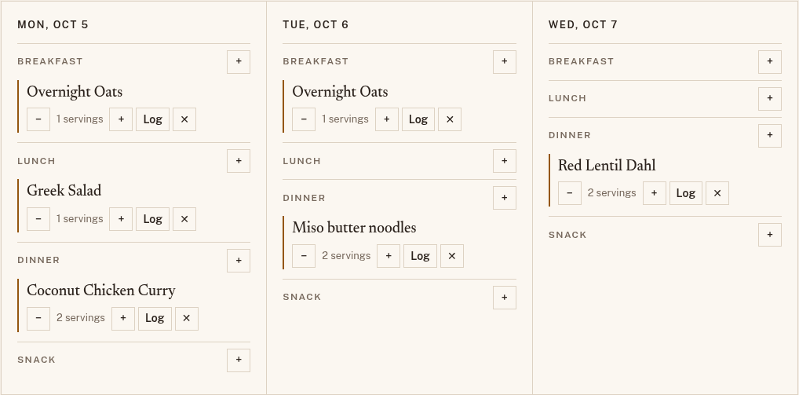
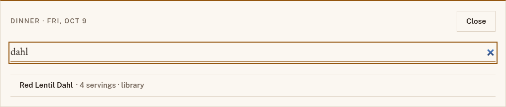
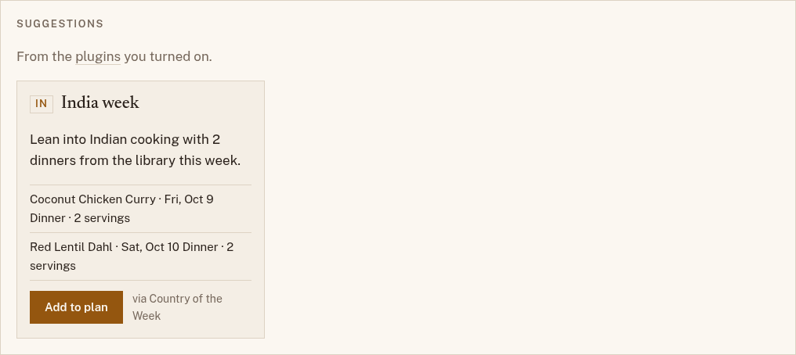

# Planning a week

Open **Plan** to see a week of meals, Monday to Sunday. Each day has four
slots: breakfast, lunch, dinner, and snack. Use **← Previous** and
**Next →** to move between weeks.

## Adding a meal

1. Choose **+** next to the slot you want to fill.
2. Search your recipes and the library, or scroll the list.
3. Choose a recipe. It goes into the slot for 2 servings.

A slot can hold more than one recipe, such as a main and a side.

## Changing a planned meal

Each planned meal has a row of buttons:

| Button      | What it does                                                    |
| ----------- | --------------------------------------------------------------- |
| **−** / **+** | Fewer or more servings, half a serving at a time.            |
| **Log**     | Adds the meal to your [food log](log.md) for that day.          |
| **✕**       | Takes the meal out of the plan.                                 |

Servings matter: the [shopping list](shopping-list.md) and the food log
both scale each recipe to the servings you planned.

To swap a meal, take it out with **✕** and add another. The Kitchen's
**Swap meal** button brings you here for that.

## Suggestions

If you've turned on a [plugin](plugins.md) that suggests meals, its ideas
appear in a **Suggestions** panel above the week. Each card says which
plugin it came from and which meals it would add.

{ width="420" }

Choose **Add to plan** to add those meals to the slots listed on the card,
or ignore the card. Nothing is added until you choose. The Kitchen may also
offer one suggested dinner for an open evening this week.

## Your plan on every device

Plans are saved as you go, so the week you plan on your laptop is the week
your phone shows in the store.
