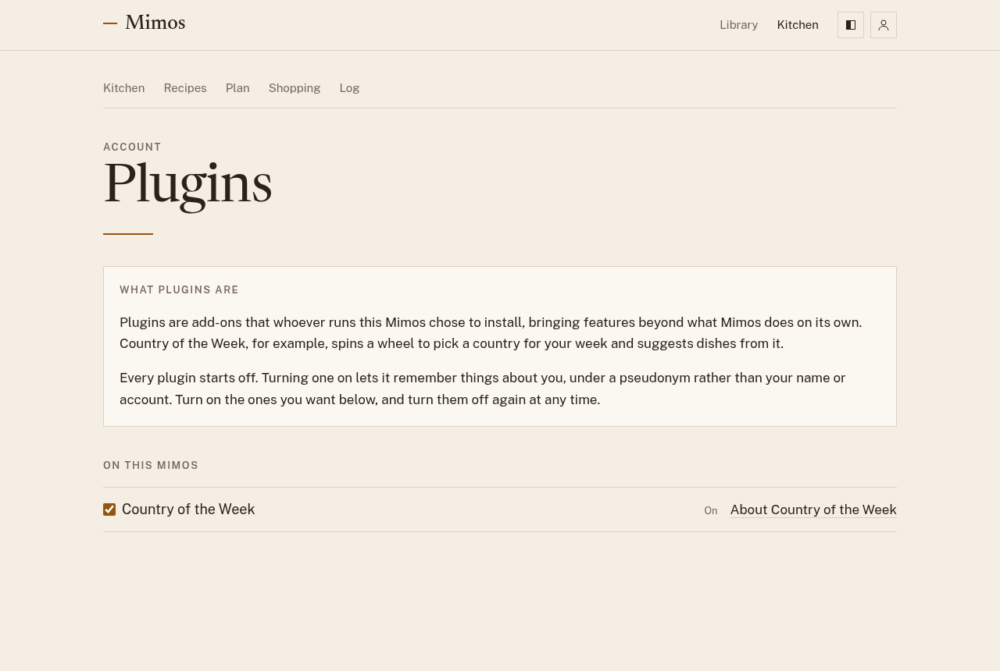

# Plugins

Plugins are add-ons that whoever runs your Mimos chose to install. They
bring features beyond what Mimos does on its own. Country of the Week, for
example, spins a wheel to pick a country for your week and suggests
library dishes from its cuisine.

To see them, open the profile menu at the top right and choose
**Plugins**.

## Turning a plugin on or off

Every plugin starts off. Tick a plugin to turn it on, and untick it to turn
it off again. The change takes effect straight away. **About** links to the
plugin's own page, where it has one.

If the page says no plugins are installed, your Mimos doesn't have any yet.

## What a plugin can see

A plugin you turn on sees the week you're planning: which slots are filled,
with how many servings, and which library recipes are in them. It also sees
the library itself. It never sees your own recipes, your food log, or who
you are, and it can't change anything in Mimos. Its suggestions only reach
your plan when you choose **Add to plan**. See
[Suggestions](planning.md#suggestions).

A plugin can remember things about you, such as which countries you've
already had. Mimos gives each plugin a made-up ID for you instead of your
name or account, and a different one for every plugin. What a plugin
remembers stays with that plugin; it isn't part of your
[account export](your-data.md).

A plugin you leave off sees nothing about you.

## Country of the Week

Country of the Week gives each week a country to cook from, picked by
spinning a wheel. You use it in the week's plan; see
[Country of the Week](planning.md#country-of-the-week) for how.

The wheel holds every country in the world, and it's yours alone:

- A country you choose for a week never comes up again.
- A country you remove never comes up again.
- A spin never lands on the same continent as the country you chose last,
  unless that continent is all that's left.

Once a week has a country, its card fills the dinners you haven't planned
yet with library recipes from that cuisine, at 2 servings each. Most
countries have no library recipes yet, and then there's no card. The
country stays chosen either way.

To write a plugin like it, see
[Country of the Week](../plugins/country-week.md) in the plugin guide.
