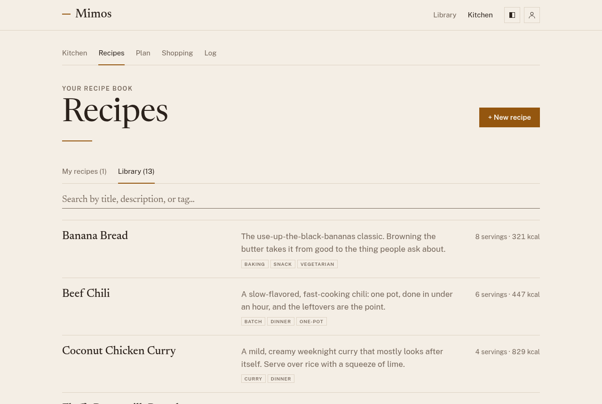
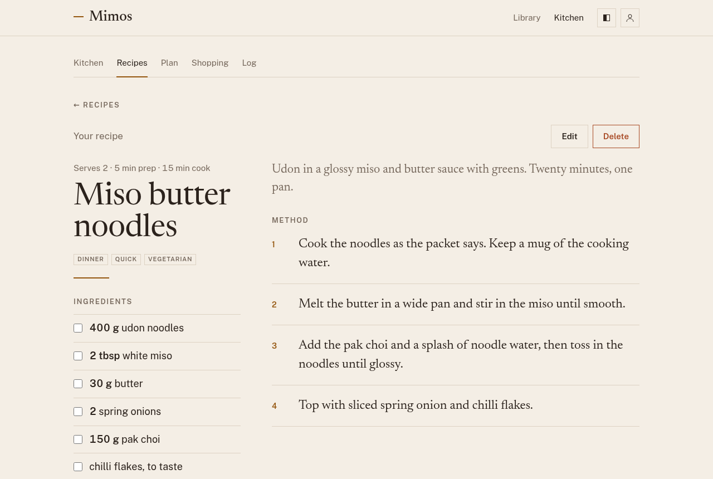
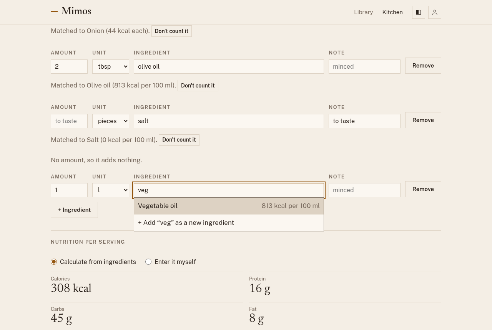
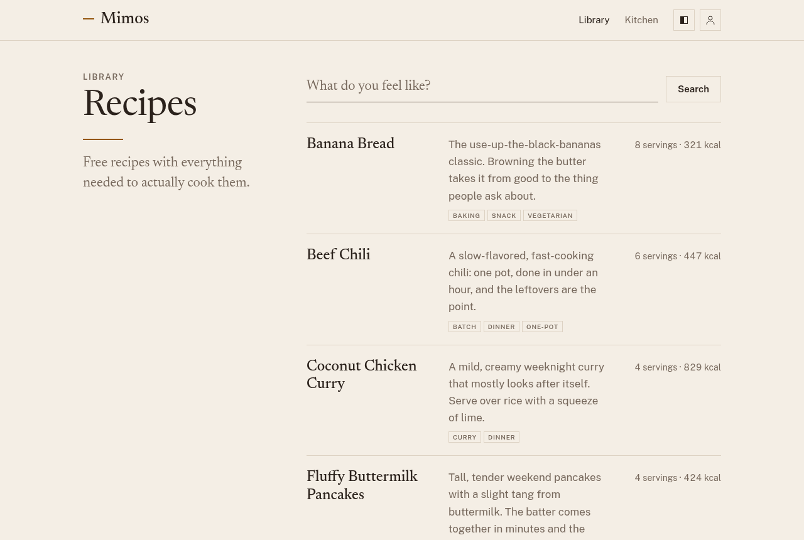

# Recipes

Open **Recipes** to see your recipe book. It has two tabs:

- **My recipes**: the recipes you've written. Only you can see them.
- **Library**: free recipes curated for everyone on this Mimos. Anyone can
  read them, signed in or not.

The search box looks through titles, descriptions, tags, and ingredient
names in the tab you're on, so "beef" also finds a chili made with beef
mince.

## Cooking from a recipe

Open any recipe to cook from it. The ingredients sit on the left and the
method on the right, with the servings, times, tags, and nutrition per
serving at the top.

Tap an ingredient to tick it off as you gather it, and tap a step to tick
it off as you go. Ticks are only a cooking aid: they stay on this page and
clear when you leave it.

## Writing your own recipe

1. In **Recipes**, choose **+ New recipe**.
2. Give it a title, a short description, and how many servings it makes.
   Prep and cook minutes and tags are optional; separate tags with commas.
3. Add the ingredients, one per line. Type each one's name and pick it
   from the list that appears; put how it's prepared, like "minced", in
   **Note**. Give it an amount and pick a unit from the list. Leave the
   amount blank for things you don't measure, like "salt, to taste", and
   choose **pieces** as the unit for things you count, like "2 eggs".
4. If an ingredient isn't in the list, choose **+ Add "…" as a new
   ingredient** and copy its calories, protein, carbs, and fat from the
   label. It's saved as your own: only you see it, and you can use it in
   any of your recipes. Under each ingredient, Mimos says what it matched;
   choose **Don't count it** if the match is wrong.
5. Under **Nutrition per serving**, leave **Calculate from ingredients**
   chosen to have Mimos work it out, or choose **Enter it myself** to type
   it in. Mimos uses it for your [food log](log.md).
6. Add the steps in order, then choose **Create recipe**.

### How nutrition is calculated

Mimos keeps a list of common ingredients with their calories, protein,
carbs, and fat, shared by everyone on this Mimos, alongside the ones you
add yourself. An ingredient adds to the recipe's nutrition when it
matches one of them and is measured in units that ingredient uses:

| The ingredient is measured by | Use these units |
| ----------------------------- | --------------- |
| Weight                        | `g`, `kg`       |
| Volume                        | `ml`, `l`, `tsp` (5 ml), `tbsp` (15 ml) |
| Count                         | `pieces`, like "2 eggs" |

Mimos uses metric units only, so the unit list has no cups or ounces;
write "250 g flour" instead of "2 cups flour". A recipe written before
then keeps its old unit, and that line doesn't count until you change
it. The form says when a line does not count and
which units would, and it shows how many ingredients are counted.
Ingredients without an amount, like salt to taste, add nothing.

Nutrition is calculated each time the recipe is shown, so when the
ingredient list improves, your recipes improve with it. Meals you have
already logged keep the nutrition they were logged with. Library recipes
are calculated the same way.

Your recipes work everywhere library recipes do: you can plan them, they
add to your shopping list, and they count in your food log.

## Editing and deleting

Open one of your recipes and choose **Edit** to change it, or **Delete** to
remove it. Library recipes are read-only.

## Sharing the library

Every library recipe has its own public page, which you can find through
**Library** at the top of any page. Send the link to anyone; they don't
need an account to read it. Your own recipes are never public.

