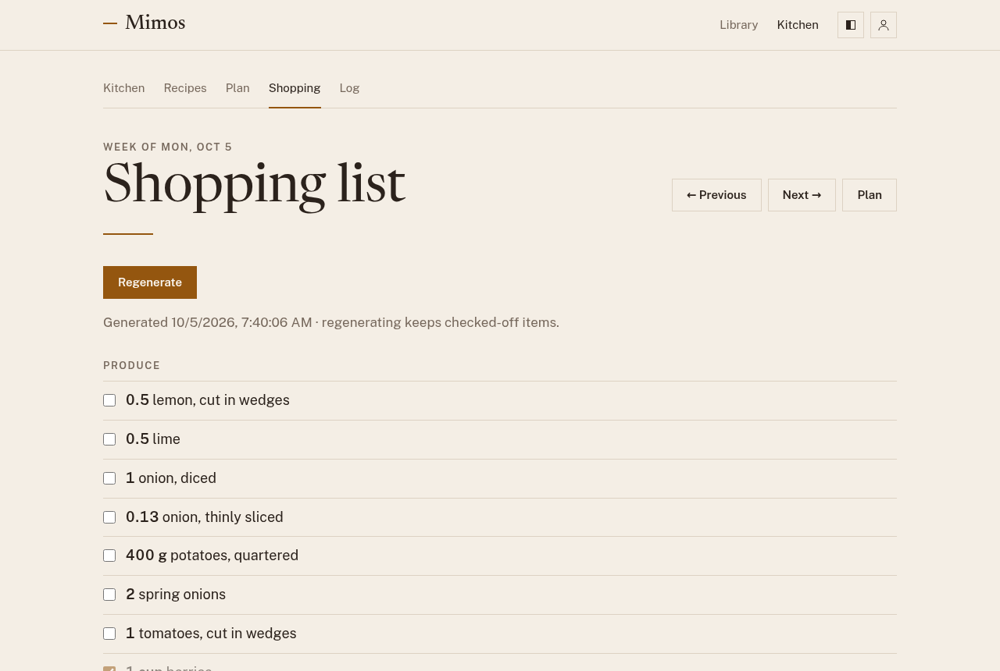

# Shopping list

Open **Shopping** to see the list for a week. Mimos builds it from that
week's [plan](planning.md): every ingredient of every planned meal, scaled
to the servings you planned, with the same ingredient added up across
recipes.

## Making the list

The first time, the page says there's no list for the week yet. Choose
**Generate from this week's plan**. The items are grouped by aisle, such
as produce and pantry, so you can shop the store in one pass.

The list doesn't change on its own when you change the plan. After editing
the week, choose **Regenerate** to bring the list up to date. Anything you
had already ticked off stays ticked off.

## In the store

Tick each item off as it goes into the basket. Ticks are saved straight
away, so the list is the same on every device you sign in on. What's still
to buy also shows on the Kitchen page.

Use **← Previous** and **Next →** to see other weeks, and **Plan** to go
back to the week's plan.
