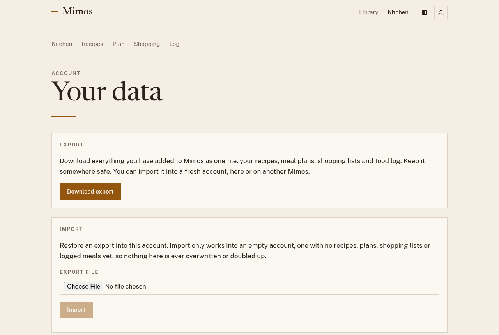

# Your data

Everything you add to Mimos is yours to take with you. Open the profile menu
at the top right and choose **Your data**.

## Exporting

Choose **Download export** to save one file with everything you've added:
your recipes, meal plans, shopping lists, and food log. Keep it somewhere
safe as a backup, or use it to move to another Mimos.

The export doesn't include which [plugins](plugins.md) you turned on, since
those depend on the server. Turn them on again after you import.

## Importing

**Import** restores an export into your account, on this Mimos or another
one.

1. Under **Import**, choose the export file.
2. Choose **Import**. Mimos reports what it restored, and any warnings.

Import only works into an empty account: one with no recipes, plans,
shopping lists, or logged meals yet. That way nothing is ever overwritten
or doubled up. If you've already started using the new account, ask
whoever runs it to give you a fresh one.

Plans and logs that use library recipes come across as long as the new
Mimos has those recipes in its library. If it doesn't, the import tells you
which ones it couldn't match.
